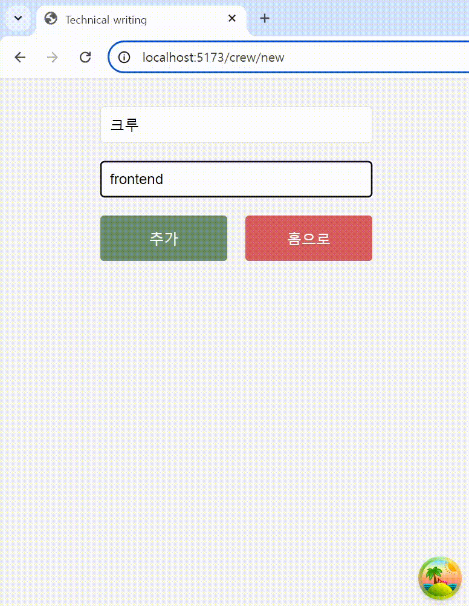
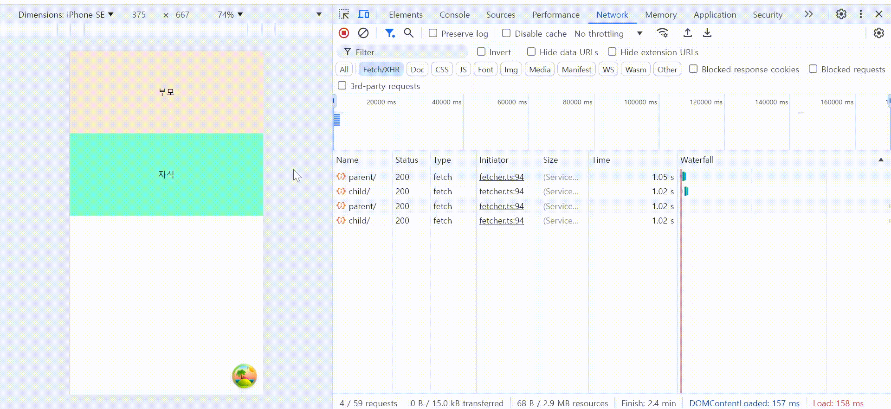
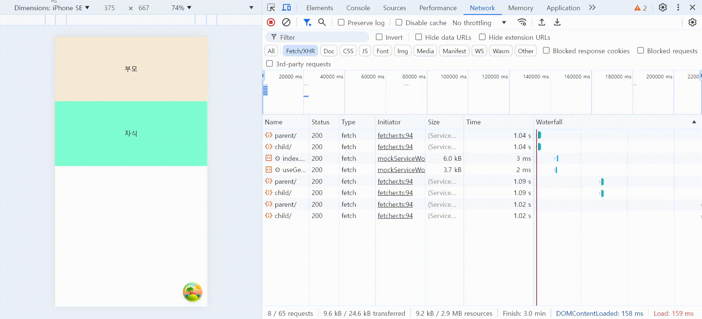

# UX를 향상시키는 서버 상태 관리 (react query v5)

## 서버 상태 관리의 필요성

프론트엔드 개발에서 상태 관리는 핵심 요소 중 하나입니다. 특히, 상태 관리가 중요한 이유는 애플리케이션의 데이터 흐름과 사용자 경험(UX)에 직접적인 영향을 미치기 때문입니다. 상태는 크게 클라이언트 상태와 서버 상태로 나눌 수 있는데, 이 중 서버 상태 관리가 왜 중요한지, 그리고 UX에 어떤 영향을 미치는지 살펴보겠습니다.

서버 상태는 서버에서 가져오는 데이터를 의미하며, 사용자는 이 데이터를 통해 중요한 결정을 내립니다. 따라서 서버 상태를 적절히 관리하는 것은 매우 중요합니다. 잘못된 데이터가 화면에 표시되거나 오래된 정보가 유지되면 사용자 경험(UX)에 큰 혼란을 초래할 수 있습니다. 반면, 정확하고 신속하게 서버 상태를 관리하면 사용자에게 실시간으로 신뢰할 수 있는 정보를 제공하여 서비스의 신뢰성을 높일 수 있습니다. 서버 상태가 적절히 관리되지 않으면 UX가 불안정해지고, 이는 곧 서비스의 품질 저하로 이어질 수 있습니다.

서버 상태를 관리해주는 라이브러리로 React-Query, swr 들 중 React-Query를 활용한 서버 상태 관리에 대해 다뤄보겠습니다.

## 1. 서버 상태 변화에 따른 캐시 데이터 관리

사용자가 입력을 하고 전송을 누르면, POST, PUT, PATCH 등의 HTTP 요청이 서버로 전송됩니다. 이러한 요청은 서버 측에서 데이터베이스의 수정, 추가, 삭제와 같은 상태 변화를 일으킵니다. 문제는 클라이언트 측에서 캐시된 데이터가 이러한 서버 상태 변화를 인지하지 못하면, 여전히 변하기 전의 데이터를 보여줄 수 있다는 점입니다. 이는 사용자가 최신 데이터를 확인하지 못하거나 잘못된 정보를 보게 되어 혼란을 초래할 수 있습니다.

따라서 서버의 상태가 변하면, 클라이언트는 이를 감지하고 캐시된 데이터를 업데이트하거나 무효화해야 합니다. 이를 통해 사용자에게 올바른 정보를 제공할 수 있게 됩니다. 서버 상태가 변했음을 클라이언트가 인지하는 방법에는 여러 가지가 있지만, 대표적으로 사용되는 방법 중 하나가 캐시 무효화(Cache Invalidation) 전략입니다.

### 캐시 무효화 전략

서버에 변화가 일어난 후, 클라이언트 측에서 해당 변화와 관련된 캐시 데이터를 무효화하여 다시 서버로부터 최신 데이터를 가져오는 방식입니다. 이 전략을 사용하면 클라이언트는 오래된 데이터를 계속 유지하지 않고, 서버의 최신 상태를 반영한 데이터를 사용자에게 제공합니다. 캐시 무효화는 주로 데이터 생성, 수정, 삭제 등의 요청이 성공한 이후에 수행되며, 이를 통해 사용자는 실시간으로 갱신된 데이터를 확인할 수 있습니다.

```tsx
const queryClient = useQueryClient();

const { mutate } = useMutation({
  mutationFn: createCrew,
  onSuccess: () => {
    queryClient.refetchQueries({ queryKey: [QUERY_KEYS.crewList] });
  },
});
```

useMutation 훅을 통해 mutate 함수를 실행시켰을 때, 요청이 성공했을 때 queryClient.invalidateQueries를 통해 queryKey에 대한 캐시를 무효화하고 다시 데이터를 불러오게 됩니다.

이 방법은 가장 익숙한 방식이며, React Query로 서버 상태 관리를 할 때 자주 사용되는 전략입니다. 하지만 invalidateQueries 메서드를 사용할 때 이러한 현상을 마주했을 수 있습니다.



#### 캐시 무효화의 한계와 개선

캐시를 무효화하는 과정에서 가끔 이전 데이터가 잠깐 보이는 현상이 발생할 수 있습니다. 이는 invalidateQueries가 현재 마운트된 컴포넌트의 활성 데이터만 즉시 업데이트하기 때문에, 비활성화된(inactive) 데이터는 즉시 갱신되지 않기 때문입니다. 이로 인해 사용자에게 불안정한 UX를 제공할 수 있습니다. 그렇다면 이런 상황에서는 어떻게 새로운 데이터를 불러와야 할까요?

invalidateQueries 옵션에서 reflective를 'inactive'로 설정하면 됩니다. 이렇게 하면 현재 화면에 보이지 않는 데이터(inactive)라도 즉시 서버로 요청을 날릴 수 있습니다.

```tsx
queryClient.invalidateQueries({
  queryKey: [QUERY_KEYS.crewList],
  reflective: "inactive",
});
```

또 다른 방식으로는 refetchQueries를 사용하여 즉시 서버로부터 데이터를 다시 가져오게 하는 방법이 있습니다. 이렇게 inactive한 데이터를 다시 요청함으로써 사용자에게 더 정확한 데이터를 빠르게 보여줄 수 있습니다.

하지만 이를 도입할 때 고려해야 할 점이 있습니다. 화면에 보이지 않는 데이터(inactive)를 다시 fetch하는만큼, 실제로 해당 데이터를 사용자가 얼마나 자주 접속하는지 확인해야 합니다. 서버로부터 새로운 정보를 미리 가져왔지만, 막상 사용자가 변경된 데이터를 잘 확인하지 않는다면 불필요한 요청일 수 있으니, 이를 적용할 때는 데이터의 중요도와 확인 빈도를 고려하여 적절히 도입해야 합니다.

### 낙관적 업데이트를 이용한 서버 상태 변화 관리

서버로의 요청이 필요하고 데이터 저장이 필요하지만, 정확한 결과가 중요하지 않은 경우(예: SNS 서비스의 '좋아요' 등)에는 사용자에게 빠르게 피드백을 주는 것이 더 나은 경험을 줄 수 있습니다. 중요한 데이터가 아니기 때문에 요청할 때마다 로딩 스피너를 보며 기다리는 것은 좋은 사용자 경험이 아닐 수 있습니다.

이러한 경우 사용할 수 있는 기법이 '낙관적 업데이트'입니다. 요청이 성공했는지 여부와 관계없이, 사용자가 한 행동에 대한 결과를 먼저 보여주는 방식입니다.

useMutation hook을 통해 mutate 함수를 실행시켰을 때 발생하며, 이번에는 onMutate, onError, onSettled 콜백을 사용하게 됩니다.

```tsx
onMutate: async (data) => {
  const previousData = queryClient.getQueryData([data]);
  queryClient.setQueryData(["data"], (old) => [...old, newData]);

  return { previousData };
};
```

먼저 `onMutate` 훅을 살펴보면 이전의 데이터를 `getQueryData`를 사용해서 미리 저장해둡니다. 이는 요청이 실패했을 때 이전의 데이터로 롤백하기 위해 사용합니다. 그 후 `setQueryData`를 통해 캐시 데이터를 요청이 성공했을 때 기대되는 값으로 변경합니다. 그리고 `previousData`를 리턴합니다.

```tsx
onError: (err, newData, context) => {
  queryClient.setQueryData(["data"], context.previousData);
};
```

`onError`는 요청이 실패했을 때 `onMutate`에서 반환한 `previousData`를 사용하여, 변경했던 데이터를 원래대로 롤백합니다.

```tsx
onSettled: () => {
  queryClient.invalidateQueries(["data"]);
};
```

마지막으로 onSettled 콜백을 살펴보면 아까 살펴본 `invalidateQueries`를 보실 수 있습니다. 요청이 성공했든 실패했든 캐시 데이터를 무효화하고, 서버로부터 최신 데이터를 다시 가져옵니다. 이를 통해 낙관적으로 업데이트한 데이터의 정확성도 보장할 수 있습니다.

지금까지 사용자가 서버로 데이터를 변경 요청했을 때의 경험에 대해 살펴보았다면, 이제는 서버로부터 데이터를 GET 요청하는 경우 더 나은 경험을 제공할 수 있는 방법을 살펴보겠습니다.

## 2. 서버 상태 불러오기

### Suspense로 인한 요청의 waterfall 현상 개선하기

`Suspense` 컴포넌트를 사용하면 요청을 기다리는 동안 빈 화면 대신 `Fallback`을 보여줄 수 있습니다. 그러나 계층 구조 상에서 부모 컴포넌트와 자식 컴포넌트가 각각 API 요청을 한다면, 요청 간에 지연이 발생할 수 있습니다. 이를 코드로 설명해 보겠습니다.

부모와 자식을 각각 1초간 API 요청을 기다리는 상황을 가정해 보겠습니다.

```tsx
 http.get(`${BASE_URL}/api/parent`, async () => {
    await new Promise(resolve => setTimeout(resolve, 1000));
    return HttpResponse.json(parent);
  }),

  http.get(`${BASE_URL}/api/child`, async () => {
    await new Promise(resolve => setTimeout(resolve, 1000));
    return HttpResponse.json(child);
  }),
```

부모 컴포넌트에 Suspense를 감싸 요청을 기다리면서 Fallback을 보여줍니다.

```tsx
<Suspense fallback={<Fallback text="부모를 불러오는 중" />}>
  <Parents />
</Suspense>
```

그리고 Parents 컴포넌트 내에서 자식을 불러옵니다.

```tsx
<Suspense fallback={<Fallback text="자식을 불러오는 중" />}>
  <Child />
</Suspense>
```

이렇게 됐을 때 부모와 자식은 각각 어떻게 보이게 될까요?



이 경우 부모의 데이터를 불러온 뒤 자식 데이터를 불러오는 데까지 1초가 추가로 소요됩니다. 이를 'Suspense Waterfall 현상'이라고 합니다.

이 문제를 해결하려면 부모와 자식의 요청을 병렬로 처리해야 합니다. React Query에서는 useQueries 훅을 사용하여 이를 간단히 해결할 수 있습니다.

```tsx
const [parent, child] = useSuspenseQueries({
  queries: [
    {
      queryKey: [QUERY_KEYS.parent],
      queryFn: getParent,
    },
    {
      queryKey: [QUERY_KEYS.child],
      queryFn: getChild,
    },
  ],
});
```

부모와 자식 컴포넌트에서 각각 데이터를 가져오는 대신, useSuspenseQueries를 사용하여 데이터를 병렬로 요청하게 하면 아래 영상과 같이 Waterfall 현상을 해결할 수 있습니다.



### 서버 상태를 미리 불러오기

서버 상태를 미리 불러옴으로써 사용자에게 로딩 화면을 보여주지 않고, 즉시 데이터를 제공할 수 있습니다. 특히 사용자가 곧바로 다음 화면으로 이동할 확률이 높을 때, 이 기능은 UX를 크게 개선할 수 있습니다.

페이지네이션이 대표적인 사례입니다. 사용자가 다음 페이지를 클릭할 가능성이 높을 때, 다음 페이지 데이터를 미리 캐시해둔다면 사용자에게 로딩 화면을 보여주지 않고 즉시 다음 페이지의 내용을 확인할 수 있습니다. 이를 통해 빠르고 매끄러운 사용자 경험을 제공할 수 있습니다.

#### queryClient.prefetchQuery

React Query에서 queryClient.prefetchQuery 메서드를 사용하면 특정 데이터를 미리 불러와서 캐시에 저장할 수 있습니다. 첫 번째 인자는 query의 Key, 두 번째 인자는 데이터를 미리 불러올 콜백 함수입니다. 이 메서드를 호출하면 지정된 콜백이 실행되어 데이터를 캐싱하게 됩니다.

```tsx
export const prefetchData = async (queryClient: QueryClient) => {
  await queryClient.prefetchQuery(["data"], () => fetch());
};
```

이 함수가 실행된 후 다음 데이터를 조회할 때 미리 가져온 데이터를 활용하여 로딩화면 없이 빠르게 보여줄 수 있습니다.

## 결론

지금까지 여러 서버 상태 관리 기법을 소개했습니다. 이런 기법들을 적절히 활용한다면, 사용자에게 더욱 빠르고 정확한 피드백을 제공함으로써 애플리케이션의 신뢰성을 높이고 사용자 경험을 크게 향상시킬 수 있습니다.
